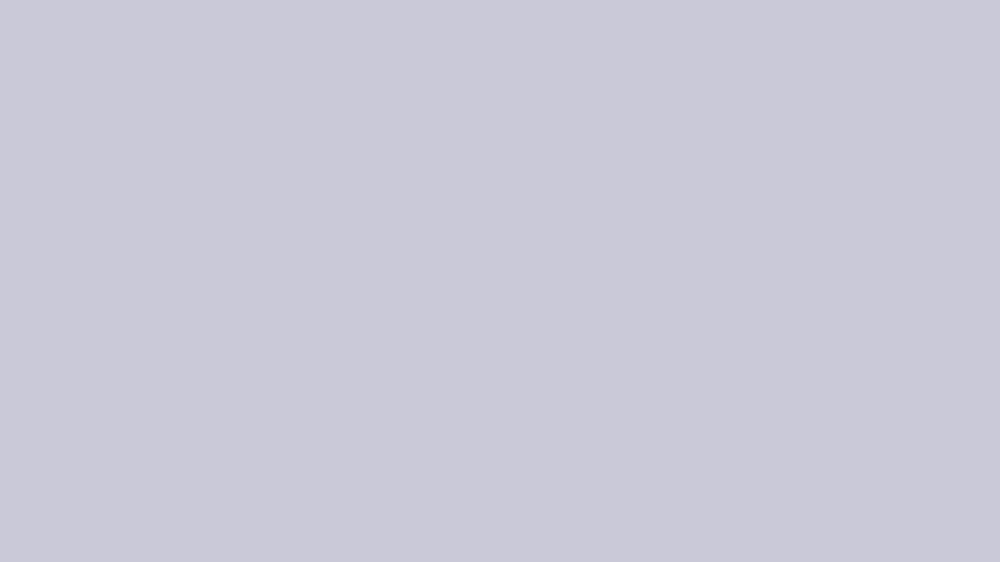

# Lab 1 Report: Rigid Body Simulation (Taichi)

## 1. Project Structure (Brief Overview)

This project is organized into four layers:

1. **Entry and configuration**
	- `main.py`: Hydra entrypoint; selects scene and simulator (`impulse` / `constraint`).
	- `cfg/scene/*.yaml`: scene definitions (objects, gravity, initial states).
	- `cfg/sim/*.yaml`: simulator parameters (time step, solver, restitution, friction, etc.).

2. **Physics core**
	- `scene.py`: global state arrays, kinematics integration, generalized mass inverse, Jacobian assembly.
	- `collision.py`: FCL-based narrow-phase collision detection; contact aggregation and impulse resolution path.
	- `simulator.py`: runtime loop, impulse-based simulator, constrained simulator (CCP/QP with SOC friction cones).

3. **Geometry and articulated modeling**
	- `rigidbody.py`: primitive/custom rigid bodies (`cuboid`, `sphere`, `cylinder`, `custom`) and inertia/mesh/FCL conversion.
	- `articulated.py`: articulated presets, chain topology, revolute/ball joints, joint limit metadata.
	- `constants.py`: procedural mesh templates for cuboid/sphere/cylinder.

4. **Interaction and utilities**
	- `interaction.py`: mouse-based external force/torque injection.
	- `util.py`: rotation utilities, tangent basis, camera rays, ray intersection helpers.

The `assets/` directory provides rigid mesh models (`*.stl`) for custom-shape experiments.

---

## 2. Basic Requirement 1: Single Rigid Body + Interaction

### What is implemented

The scene `single.yaml` initializes one free cuboid with nonzero linear and angular velocity.
This validates rigid-body translation and rotation updates under explicit Euler integration.

### Keyboard and mouse controls

1. **Camera controls (Taichi default style)**
	- `A`: move left
	- `D`: move right
	- `W`: zoom in / move forward
	- `S`: zoom out / move backward
	- `Q`: move down
	- `E`: move up

2. **Object interaction (implemented in `interaction.py`)**
	- Hold `CTRL` to enter interaction mode.
	- **Left click + drag**: apply force (translation mode).
	- **Right click + drag**: apply torque (rotation mode).

### Reproduce

Run from `lab1/`:

```bash
python main.py scene=single sim=impulse
```


---

## 3. Basic Requirement 2: Two-Body Collision

### Collision scene meanings

1. `collision1.yaml`: edge-dominant contact.
2. `collision2.yaml`: corner to face collision.
3. `collision3.yaml`: face-to-face collision.

These three scenes are intentionally configured to produce different contact manifolds and validate robustness of contact normal/point handling.

### Implementation choices

1. **Collision detection**
	- Uses `python-fcl` (FCL) in `collision.py`.
	- Each pair updates transforms and queries contacts via `fcl.collide`.

2. **Multiple-contact handling**
	- For each colliding pair, multiple raw contacts are collected.
	- Contacts are reduced using a multi-contact selection policy.
	- In impulse mode, selected contacts are averaged into one representative contact per pair (normal/point), with a depth term retained for penetration correction.

3. **Impulse model with bias**

For a contact pair `(a,b)`:

$$
\mathbf{v}_{rel} = (\mathbf{v}_a + \boldsymbol\omega_a \times \mathbf{x}_a) - (\mathbf{v}_b + \boldsymbol\omega_b \times \mathbf{x}_b)
$$

$$
v_n = \mathbf{v}_{rel}\cdot\mathbf{n},\quad
\mathbf{v}_t = \mathbf{v}_{rel} - v_n\mathbf{n}
$$

Normal denominator:

$$
\kappa_n = m_a^{-1} + m_b^{-1} +
\left( (\mathbf{I}_a^{-1}(\mathbf{x}_a\times\mathbf{n}))\times\mathbf{x}_a +
(\mathbf{I}_b^{-1}(\mathbf{x}_b\times\mathbf{n}))\times\mathbf{x}_b \right)\cdot\mathbf{n}
$$

Bias term (Baumgarte-style penetration correction):

$$
b = \frac{\beta}{\Delta t}\max(d-\text{slop},0)
$$

Normal impulse:

$$
J_n = \frac{-(1+e)v_n + b}{\kappa_n}
$$

Tangential impulse (Coulomb clamp):

$$
J_t = \text{clamp}\left(-\frac{\|\mathbf{v}_t\|}{\kappa_n},-\mu J_n,\mu J_n\right)
$$

Final impulse:

$$
\mathbf{J} = J_n\mathbf{n} + J_t\mathbf{t}
$$

### Reproduce

```bash
python main.py scene=collision1 sim=impulse
python main.py scene=collision2 sim=impulse
python main.py scene=collision3 sim=impulse
```


---

## 4. Basic Requirement 3: Complex Scene

### Differences among complex scenes

1. `complex1.yaml`
	- Dynamic objects are all cuboids.
	- Includes stacked, launched, and spinning cuboids in one simulation.

2. `complex2.yaml`
	- Extends `complex1` with primitive diversity:
	  - sphere
	  - cylinder
	- Used to verify primitive-specific inertia/collision support.

3. `complex3.yaml`
	- Extends `complex1` with custom meshes from `assets/` (`bunny`, `foam_brick`, `water_bottle`).
	- Used to verify mesh-based rigid body.

### Enclosed room scene

All `complex*` scenes include a closed room made of frozen cuboids:

1. floor
2. ceiling
3. front wall
4. back wall
5. left wall
6. right wall

This creates bounded multi-impact trajectories and stress-tests repeated contact resolution.

### Reproduce

```bash
python main.py scene=complex1 sim=impulse
python main.py scene=complex2 sim=impulse
python main.py scene=complex3 sim=impulse
```


---

## 5. Bonus B1: Multi-body Newton-Cradle-style Transfer

### Scene description

1. `cradle_cuboid.yaml`: five cuboids arranged vertically, top one has initial downward velocity.
2. `cradle_sphere.yaml`: same setup but with spheres.

### Key implementation point for cuboids

Cuboids often generate **multiple simultaneous contacts** (feature-feature manifolds).
The code uses a **multiple-contact selection + averaging** strategy so the resolved contact better represents the manifold, improving momentum transfer realism compared with single-point naive resolution.

For a selected contact set $\{(\mathbf{n}_k, \mathbf{p}_k, d_k)\}_{k=1}^m$ between the same pair, the representative contact used by the impulse solver is

$$
\bar{\mathbf{n}} = \frac{\sum_{k=1}^m \mathbf{n}_k}{\left\|\sum_{k=1}^m \mathbf{n}_k\right\| + \varepsilon},
\quad
\bar{\mathbf{p}} = \frac{1}{m}\sum_{k=1}^m \mathbf{p}_k,
\quad
\bar{d} = \max_{1\le k\le m} d_k.
$$

This averaging keeps the dominant contact direction while reducing manifold noise and preserving the deepest penetration depth for bias correction.

### Reproduce

Use elastic impulse setup for clearer transfer behavior:

```bash
python main.py scene=cradle_cuboid sim=impulse_elastic
python main.py scene=cradle_sphere sim=impulse_elastic
```



---

## 6. Bonus B2: Stable Stacking

### Scene description

`stack.yaml` builds a 6-layer cuboid stack under gravity on a frozen floor.

### Why it is more stable

1. **Bias term**
	- The penetration correction term
	  $$b = \frac{\beta}{\Delta t}\max(d-\text{slop},0)$$
	  actively pushes objects apart when penetration accumulates.
	- This reduces sink-in and long-term interpenetration drift.

2. **Multiple-contact aggregation**
	- A richer contact manifold representation reduces noisy alternating impulses.
	- This helps suppress jitter and improves resting-contact behavior.

### Reproduce

```bash
python main.py scene=stack sim=impulse
```


---

## 7. Bonus B3: Complex Geometry, Sphere/Cylinder, Convex Hull

### Primitive support

Implemented in `rigidbody.py`:

1. `Sphere`: analytic inertia + sphere mesh template + FCL sphere geometry.
2. `Cylinder`: analytic inertia + cylinder mesh template + FCL cylinder geometry.

### Custom mesh support

`Custom` rigid body loads STL from `assets/` and builds an FCL BVH model for collision.

### Convex hull option

For custom meshes:

```python
if convexify:
    mesh = mesh.convex_hull
```

This is implemented via `trimesh`, enabling robust convex proxy experiments.

### Reproduce

```bash
python main.py scene=complex2 sim=impulse
python main.py scene=complex3 sim=impulse
python main.py scene=custom sim=impulse
```


---

## 8. Bonus B4: Constrained Dynamics Design

### Design choice

A dedicated constrained simulator (`ConstraintSimulator`) solves contact and joint constraints **simultaneously** at velocity level.

### From constrained dynamics to CCP

The derivation follows the standard complementarity view shown in the three reference equations.

1. **Nonlinear complementarity problem (NCP) for frictional contact**

For each contact $i$, the Coulomb cone is

$$
K_{\mu(i)} = \{\lambda_i = (\lambda_{n}, \lambda_{t}) \mid \lambda_n \ge 0,\ \|\lambda_t\|_2 \le \mu \lambda_n\}.
$$

The Signorini/friction contact cases correspond to:

$$
\lambda^{(i)} \in K_{\mu(i)},\ c_N^{(i)} = 0
$$

$$
\lambda^{(i)} = 0,\ c_N^{(i)} > 0
$$

$$
\lambda^{(i)} \in \partial K_{\mu(i)},\ \exists\alpha>0,\ \lambda_T^{(i)} = -\alpha c_T^{(i)}
$$

where $c^{(i)}$ is the relative contact velocity, and $\partial K_{\mu(i)}$ is the cone boundary. This is the nonlinear complementarity formulation shown in the first image.

2. **Relaxation to a cone complementarity problem (CCP)**

Directly enforcing the case distinction above is awkward because the contact mode is unknown in advance. We relax the NCP to the CCP form

$$
K_{\mu} \ni \lambda \perp c \in K_{\mu}^*.
$$

Here $K_\mu^*$ is the dual cone. This moves the problem into a convex cone setting while keeping the complementarity structure.

3. **Dual/QCQP form used in the implementation**

Starting from the impulse-momentum relation:

$$
\mathbf{v}_{new} = \mathbf{v}_{free} + \mathbf{M}^{-1}\mathbf{J}^T\boldsymbol\lambda
$$

The generalized contact velocity is therefore

$$
\mathbf{c} = \mathbf{J}\mathbf{v}_{new}
= \mathbf{J}\mathbf{v}_{free} + \mathbf{J}\mathbf{M}^{-1}\mathbf{J}^T\boldsymbol\lambda
= \mathbf{g} + \mathbf{G}\boldsymbol\lambda,
$$

with

$$
\mathbf{G} = \mathbf{J}\mathbf{M}^{-1}\mathbf{J}^T,
\quad
\mathbf{g} = \mathbf{J}\mathbf{v}_{free}
$$

The CCP can then be written as the KKT conditions of the equivalent quadratically constrained quadratic program:

$$
\min_{\lambda}\ \frac{1}{2}\lambda^T\mathbf{G}\lambda + \mathbf{g}^T\lambda
$$

subject to:

1. Contact normal non-negativity: $\lambda_n \ge 0$
2. Friction cone (SOC): $\|\lambda_t\|_2 \le \mu\lambda_n$
3. Bilateral equalities for articulated joints: $\mathbf{A}_{eq}\lambda = \mathbf{b}_{eq}$
4. Active unilateral joint-limit rows: $\lambda_{limit} \ge 0$

### Solver implementation choice

1. `cvxpy` is used for concise mathematical expression.
2. `CLARABEL` is used as the conic backend in `constraint.yaml`.
3. A small regularization (`R`) is added to stabilize the convex objective.

### Reproduce

```bash
python main.py scene=collision1 sim=constraint
python main.py scene=collision2 sim=constraint
python main.py scene=collision3 sim=constraint
python main.py scene=complex2 sim=constraint
python main.py scene=complex3 sim=constraint
python main.py scene=cradle_cuboid sim=constraint_elastic
python main.py scene=cradle_sphere sim=constraint_elastic
python main.py scene=stack sim=constraint
```


---

## 9. Bonus B5: Articulated Bodies (Maximal Coordinates)

### Modeling choice: maximal coordinates

Each link is a full rigid body in world coordinates (6 DoF per link):

$$
\mathbf{v} = [\mathbf{v}_0,\boldsymbol\omega_0,\ldots,\mathbf{v}_{N-1},\boldsymbol\omega_{N-1}]
$$

No reduced-coordinate joint parameterization is used.

### Hard equalities for joints

1. Position coincidence constraints at joint anchors.
2. Revolute axis-alignment constraints (2 angular rows, hinge axis free).

These are assembled as equality rows in the generalized jacobian.

### Viewing joint angle limit as contact and reducing it to same CCP framework

When a revolute limit becomes active, the implementation adds rows to the generalized jacobian matrix and associates with them nonnegative impulses in $\boldsymbol{\lambda}$, exactly analogous to frictionless unilateral contact normals.

Therefore contact constraints and joint-limit constraints are solved in one unified impulse vector `lambda` within the same conic program.

### Reproduce

```bash
python main.py scene=articulated_revolute sim=constraint
python main.py scene=articulated_ball sim=constraint
```


